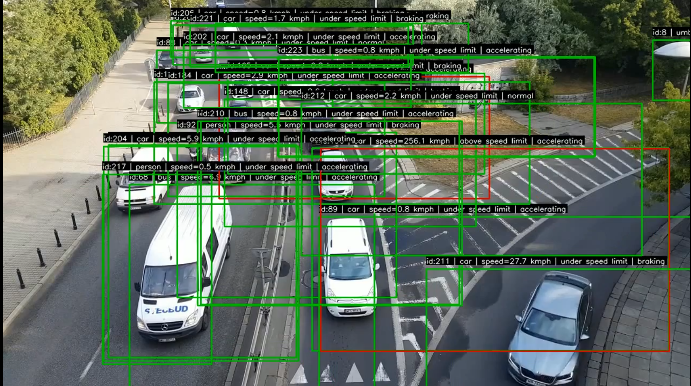
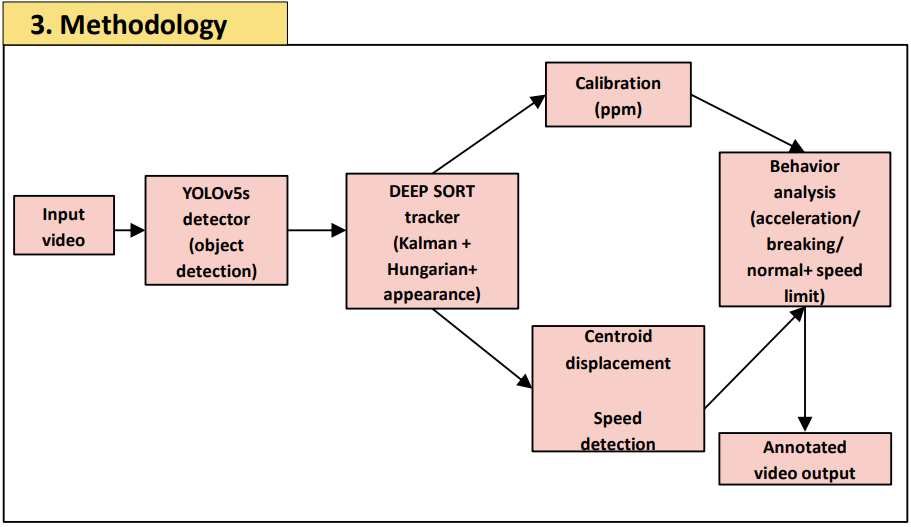
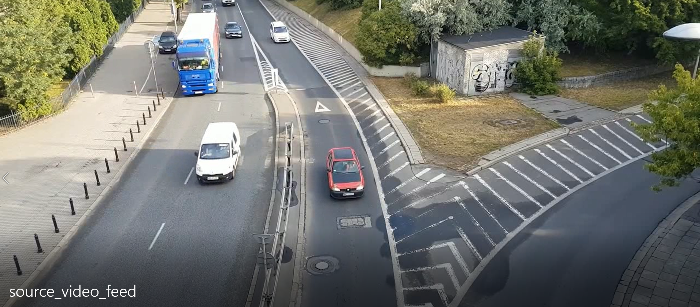
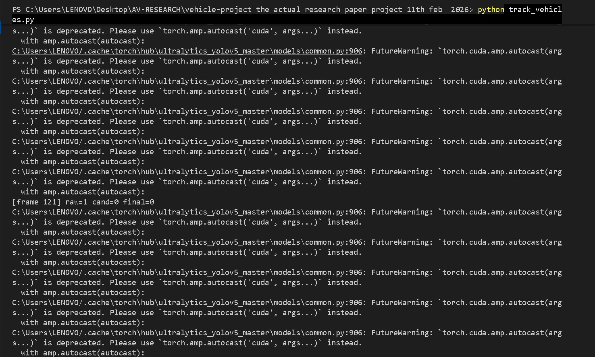
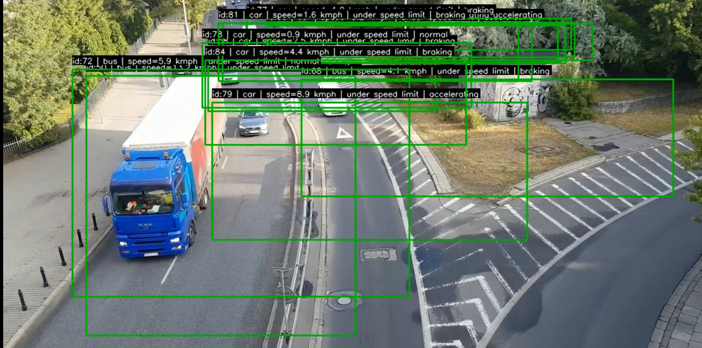

# Vehicle Detection, Tracking and Behavior Analysis using YOLOv5 and Deep SORT



## Overview

This project presents an end-to-end computer vision system for real-time vehicle detection, multi-object tracking, speed estimation, and driving behavior analysis from traffic video streams.

The system combines **YOLOv5** for vehicle detection and **Deep SORT** for object tracking to maintain vehicle identities across frames and estimate real-world vehicle speeds and behaviors. The output is an annotated video containing vehicle IDs, speed estimates, and behavioral labels.

---

## Key Features

* Real-time vehicle detection using YOLOv5
* Multi-object tracking using Deep SORT
* Vehicle speed estimation using pixel-to-meter calibration
* Driving behavior classification:

  * Accelerating
  * Braking
  * Normal Driving
  * Speed-limit violation detection
* Annotated output video generation
* CPU and GPU compatible deployment

---

## System Architecture



The system follows the pipeline below:

```text
Input Video
      ↓
YOLOv5 Vehicle Detection
      ↓
Deep SORT Multi-Object Tracking
      ↓
Speed Estimation & Calibration
      ↓
Behavior Analysis
      ↓
Annotated Output Video
```

---

## Results

### Raw Traffic Video



### Vehicle Detection and Tracking



### Final Annotated Output



---

## Technology Stack

* Python
* PyTorch
* OpenCV
* YOLOv5
* Deep SORT
* NumPy
* Matplotlib

---

## Project Structure

```text
.
├── assets/
│   ├── banner.png
│   ├── workflow.png
│   ├── before.png
│   ├── detection.png
│   └── after.png
│
├── track_vehicles.py
├── test_video.py
├── video_to_frames.py
├── get_coords.py
│
├── source_video_feed.avi
├── debug_initial_output.avi
├── debug_trial2_output.avi
├── final_output.mp4
│
├── train/
├── valid/
├── yolov5/
│
└── README.md
```

---

## Methodology

### 1. Vehicle Detection

YOLOv5 is used to detect vehicles such as cars, buses, and trucks from each frame of the input video.

### 2. Multi-Object Tracking

Deep SORT assigns a unique identity to every detected vehicle and maintains tracking using:

* Kalman Filter
* Hungarian Algorithm
* Appearance Feature Matching

### 3. Speed Estimation

Vehicle speed is estimated using:

* Pixel-per-meter calibration
* Centroid displacement between frames
* Frame rate information

### 4. Behavior Analysis

Each tracked vehicle is classified as:

* Accelerating
* Braking
* Normal Driving
* Speed Limit Violation

---

## Performance

| Metric          | Value     |
| --------------- | --------- |
| Accuracy        | 97%       |
| Precision       | 93%       |
| Recall          | 89%       |
| CPU Performance | 8–12 FPS  |
| GPU Performance | 25–30 FPS |

---

## Installation

Clone the repository:

```bash
git clone https://github.com/shreyasnr18/Vehicle-detection-tracking-and-behavior-analysis-using-YOLOv5-DEEP-SORT-Algorithm.git

cd Vehicle-detection-tracking-and-behavior-analysis-using-YOLOv5-DEEP-SORT-Algorithm
```

Install dependencies:

```bash
pip install -r yolov5/requirements.txt
pip install deep-sort-realtime filterpy lap
```

---

## Running the Project

Run vehicle detection and tracking:

```bash
python track_vehicles.py
```

Extract video frames:

```bash
python video_to_frames.py
```

Obtain calibration coordinates:

```bash
python get_coords.py
```

---

## Demonstration Videos

The repository includes the following output videos:

* `source_video_feed.avi`
* `debug_initial_output.avi`
* `debug_trial2_output.avi`
* `final_output.mp4`

---

## Future Enhancements

* Lane change detection
* Aggressive driving detection
* Overtaking detection
* Real-time CCTV integration
* Traffic analytics dashboard
* Multi-camera support
* Traffic congestion prediction

---

## Author

**Shreyas N.R**
B.Tech in Robotics Engineering
Garden City University, Bengaluru, India

GitHub Profile: https://github.com/shreyasnr18

Project Repository:
https://github.com/shreyasnr18/Vehicle-detection-tracking-and-behavior-analysis-using-YOLOv5-DEEP-SORT-Algorithm
